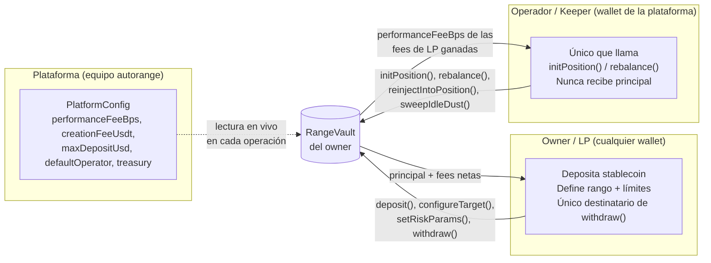
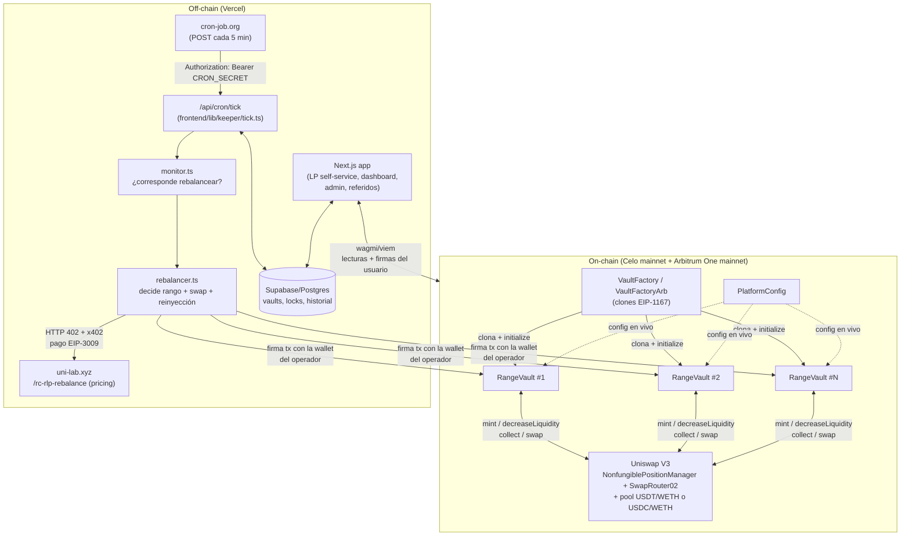
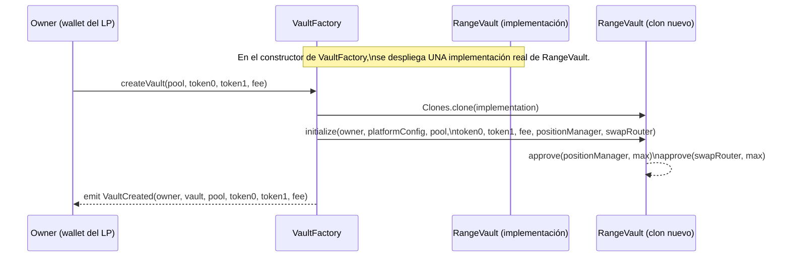
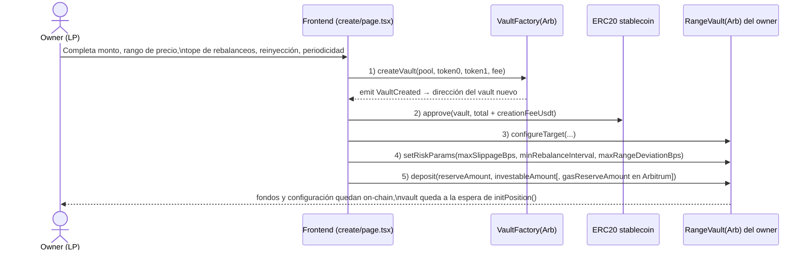
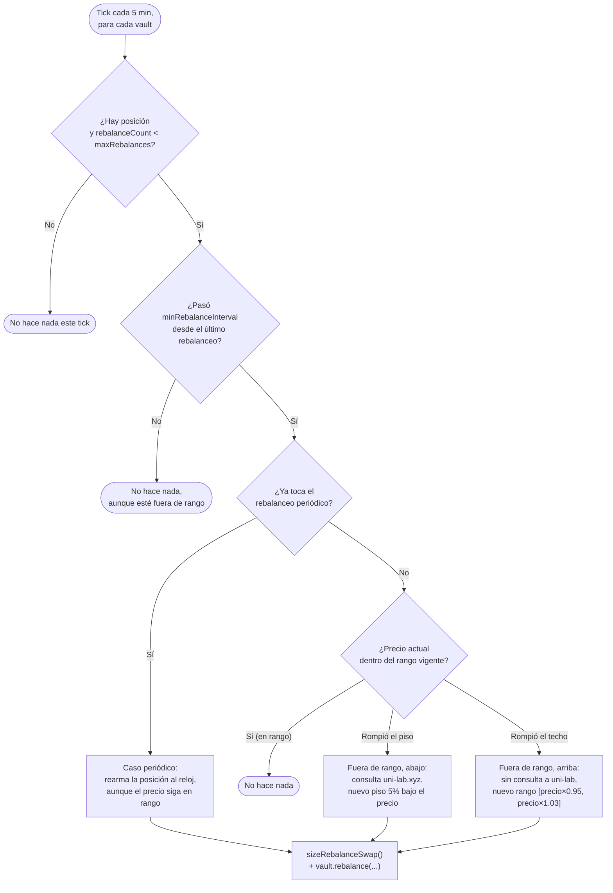
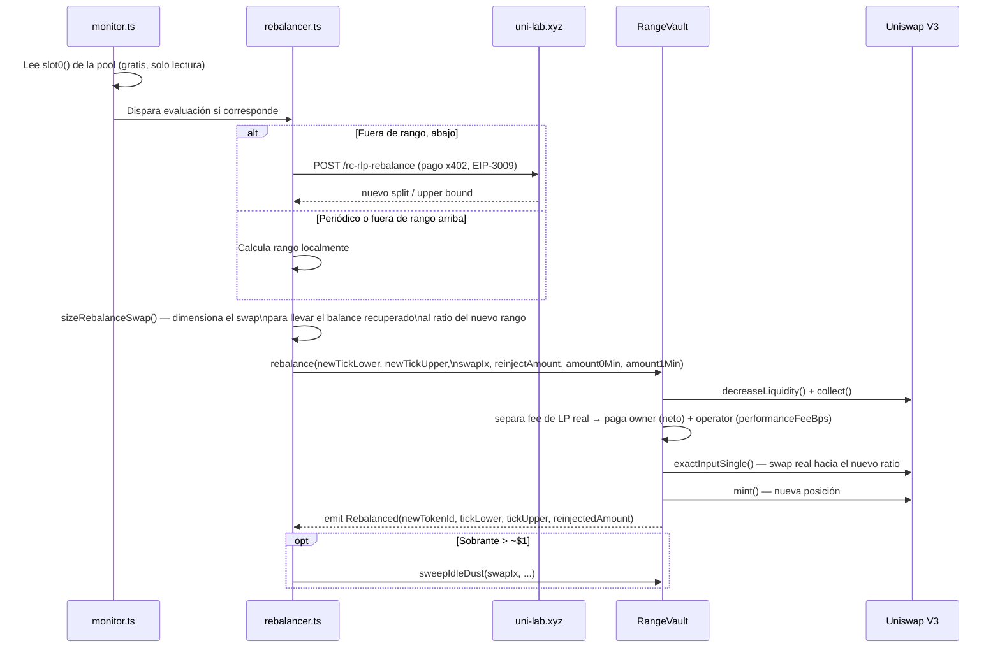
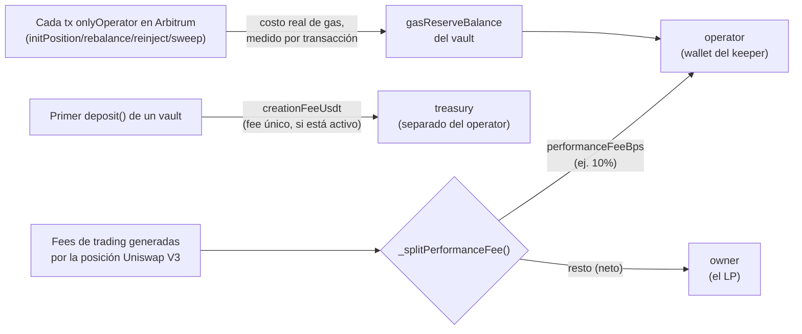
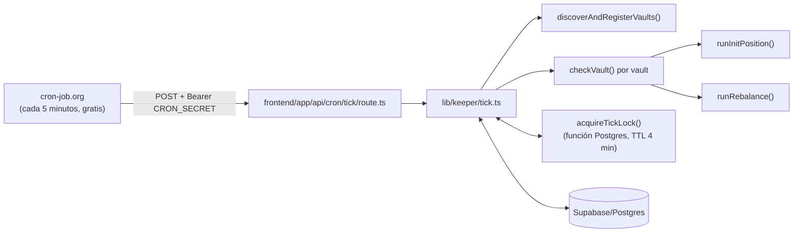
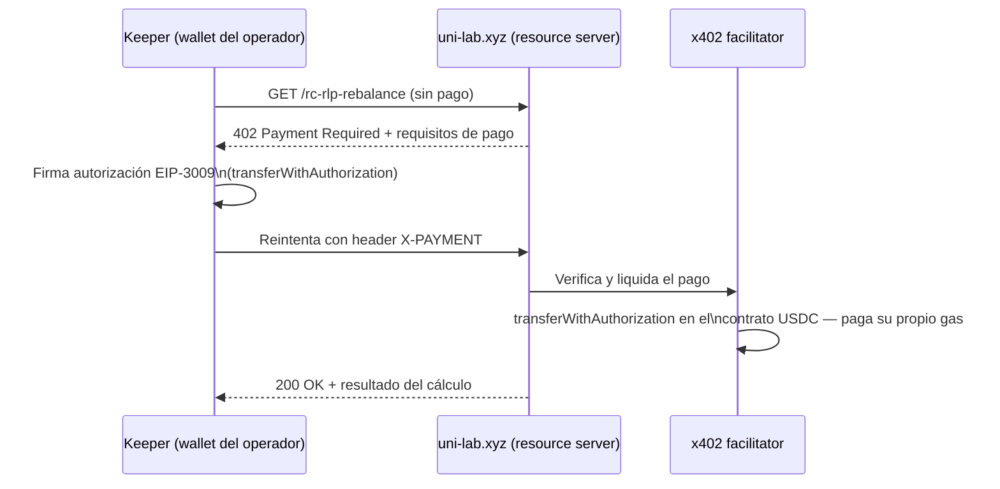
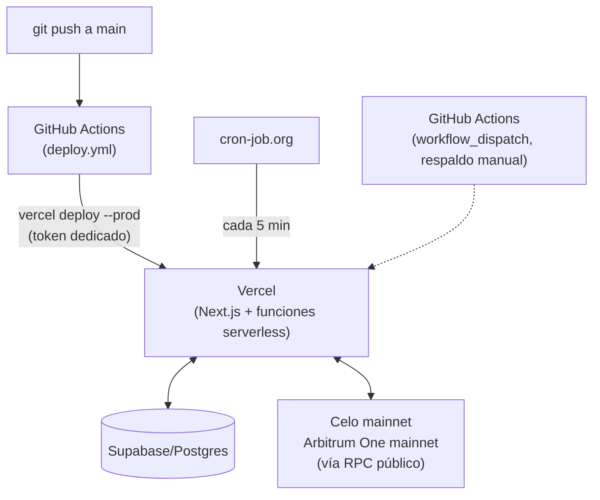

# Arquitectura técnica de autorange (uni-bot-agent)

> Informe de arquitectura para una audiencia técnica con conocimiento de blockchain,
> explicando el proyecto desde cero: qué problema resuelve, cómo está construido, y cómo
> fluyen los datos y el dinero entre sus capas.
>
> Fuente: código en `/Users/elkiyo.eth/Desktop/DEFAI` (contratos en `contracts/src/`,
> keeper en `frontend/lib/keeper/` y `agent/`, frontend en `frontend/app/`). Este informe
> describe el **estado real del código**, no solo el diseño original — donde el código
> difiere de la documentación de diseño (`autorange.md`, `AGENTE.md`), se documenta la
> versión vigente y se señala el cambio.

---

## 1. Resumen ejecutivo

**autorange** (nombre de proyecto en el registro del hackathon: `uni-bot-agent` /
"UniAgent") es una **plataforma no-custodial de gestión activa de liquidez concentrada
en Uniswap V3**, operando en producción sobre **Celo** y **Arbitrum One**.

En una frase: cualquier persona conecta su wallet, deposita un único stablecoin (USDT en
Celo, USDC en Arbitrum), define un rango de precio objetivo para un par
stablecoin/WETH, y un **agente keeper operado por la plataforma** arma y rebalancea
automáticamente una posición de liquidez concentrada en su nombre — **sin tener nunca
custodia del capital del usuario**. El agente cobra un porcentaje de las comisiones de
trading (fees de LP) que la posición efectivamente genera; nunca toca el principal.

Piezas del sistema:

| Capa | Qué es | Dónde vive |
|---|---|---|
| **Contratos** | `PlatformConfig`, `VaultFactory`(`Arb`), `RangeVault`(`Arb`) — Solidity/Foundry | Celo mainnet + Arbitrum One mainnet |
| **Keeper (agente)** | Lógica de decisión y ejecución de rebalanceos, multi-vault, multi-chain | `frontend/lib/keeper/`, corre como función serverless en Vercel |
| **Frontend** | Next.js — autoservicio del LP, dashboard público, panel admin, sistema de referidos | Vercel |
| **Estado durable** | Vaults descubiertos, historial de llamadas a uni-lab, sesiones, referidos | Supabase/Postgres |
| **Disparador** | Cron externo que invoca el tick del keeper cada 5 minutos | cron-job.org → `POST /api/cron/tick` |
| **Servicio externo de pricing** | `uni-lab.xyz` — calcula el split de rebalanceo (RC/RLP), pagado por HTTP 402 + x402 | Servicio propio, aparte de este repo |

---

## 2. El problema y la idea central

Proveer liquidez concentrada en Uniswap V3 exige elegir un rango de precio `[tickLower,
tickUpper]`. Mientras el precio de mercado esté dentro del rango, la posición cobra fees
de trading; en cuanto el precio sale del rango, la posición deja de generar fees y queda
compuesta 100% por uno de los dos tokens. Gestionar esto bien requiere monitoreo
constante y rebalanceos (cerrar la posición vieja, reacomodar los tokens, abrir una
nueva) — trabajo manual que la mayoría de los proveedores de liquidez no hace.

autorange resuelve esto con un **agente automatizado (keeper)** que:

1. Vigila el precio de la pool cada 5 minutos.
2. Decide si conviene rebalancear (fuera de rango, o por reloj periódico).
3. Ejecuta el rebalanceo on-chain dentro de límites que el propio dueño del capital
   configuró de antemano.

La pieza de diseño que hace esto **seguro para terceros** es que el contrato separa
estrictamente dos roles: quien **puede operar** la posición (el keeper) nunca puede
**retirar** el capital — ver §5.

---

## 3. Conceptos previos (glosario mínimo)

Para quien conoce blockchain en general pero no este proyecto en particular:

- **Uniswap V3 / liquidez concentrada:** a diferencia de Uniswap V2 (liquidez repartida
  en todo el rango de precios `[0, ∞]`), V3 permite proveer liquidez solo dentro de un
  rango de precio elegido (`tickLower`–`tickUpper`), lo que multiplica el fee generado
  por dólar depositado mientras el precio se mantenga dentro de ese rango.
- **Tick:** unidad discreta de precio en Uniswap V3; el precio real es `1.0001^tick`.
  Los rangos de una posición se definen como un par de ticks.
- **Posición NFT:** cada posición de liquidez V3 es un ERC-721 emitido por el
  `NonfungiblePositionManager` de Uniswap. Quien posee el NFT controla esa posición.
- **EIP-1167 (minimal proxy / "clon"):** patrón para desplegar muchas instancias baratas
  de un mismo contrato, todas delegando su lógica a una única implementación. Es lo que
  permite que crear un vault nuevo cueste poco gas.
- **Non-custodial:** el operador de la plataforma puede *accionar* el contrato pero
  nunca puede hacer que el contrato le transfiera el capital de otro. Ver §5.
- **ERC-8021 (Attribution Tags):** estándar que permite anexar un sufijo de datos a
  cualquier transacción para atribuirla a un proyecto en un leaderboard público, sin
  cambiar lo que la transacción hace.
- **x402 / HTTP 402 Payment Required:** protocolo de pago sobre HTTP donde un servidor
  responde `402` con los requisitos de pago, el cliente firma una autorización EIP-3009
  (`transferWithAuthorization`), y un *facilitator* la liquida on-chain sin que el
  cliente necesite enviar su propia transacción.
- **SIWE (EIP-4361, Sign-In With Ethereum):** mecanismo de autenticación donde el
  usuario firma un mensaje estructurado con su wallet para probar posesión de la
  dirección, sin contraseña.

---

## 4. Los tres roles del sistema

| Rol | Quién | Qué controla | Qué NUNCA puede hacer |
|---|---|---|---|
| **Plataforma** | El equipo (dueño de `PlatformConfig`, `Ownable2Step`) | `performanceFeeBps` (corte de las fees de LP), `creationFeeUsdt` (fee único de alta), `maxDepositUsd` (tope por vault), `defaultOperator`, `treasury` | Tocar el capital de un vault individual directamente |
| **Owner (LP)** | Cualquier wallet pública | Crea su vault, deposita, define rango objetivo, topes de rebalanceo/reinyección, puede pausar/revocar al operador y retirar en cualquier momento | — (es el único destinatario válido de `withdraw()`) |
| **Operador / keeper** | Wallet(s) de la plataforma | Ejecuta `initPosition()`/`rebalance()`/`reinjectIntoPosition()`/`sweepIdleDust()` dentro de los límites que fijó el owner | Retirar principal; el NFT de posición y los fondos **siempre** quedan dentro del vault |

---

## 5. Garantía no-custodial (por qué un desconocido puede confiar en esto)

Esto es el núcleo de seguridad del diseño, implementado en `RangeVault.sol`:

- `withdraw()`, `withdrawAll()` y `emergencyWithdrawPosition()` transfieren **siempre y
  únicamente a `owner`** — una dirección fija guardada en el estado del contrato, jamás
  un parámetro de la función. El operador no puede ser destinatario de una transferencia
  de principal, ni siquiera indirectamente.
- `initPosition()`, `rebalance()`, `reinjectIntoPosition()` y `sweepIdleDust()` son
  `onlyOperator`, pero todos los fondos y el NFT de la posición Uniswap **permanecen
  siempre dentro del contrato del vault** — el `recipient` de cada llamada a Uniswap es
  siempre `address(this)`, nunca el operador.
- El rango que use el operador (inicial o en cada rebalanceo) se valida on-chain contra
  el precio de mercado vigente (`_checkRangeNearMarket`, con una tolerancia
  `maxRangeDeviationBps` fijada por el owner) — el operador no puede minar una posición
  con un rango arbitrario y lejano del precio real.
- El owner puede revocar/reemplazar al operador en cualquier momento
  (`setOperator(address(0))` = kill switch total) y tiene `emergencyWithdrawPosition()`
  para forzar el cierre de la posición sin depender de que el operador coopere.
- La única forma en que el operador recibe dinero del vault es su corte de
  `performanceFeeBps` sobre las **fees de LP realmente ganadas** (nunca sobre el
  principal) — ver §8.4. En Arbitrum, además, un reembolso de gas medido por
  transacción real (ver §7.3).
- `closeVault()` es irreversible y solo permite cerrarse cuando el vault está
  verificablemente vacío (posición cerrada, los tres ledgers en cero, balances reales de
  token0/token1 en cero) — evita que un vault abandonado quede "reactivable" por
  accidente si alguien le transfiere tokens después.

---

## 6. Arquitectura general

**Cómo leer este diagrama:** la única forma en que dinero se mueve on-chain es a través
de transacciones firmadas — por el owner (deposit/withdraw/configuración) o por la
wallet del operador (init/rebalance, disparada automáticamente por el tick). El
frontend nunca actúa como intermediario de fondos: solo construye y envía transacciones
que la propia wallet del usuario firma (para el LP) o lee estado público (para el
dashboard).

---

## 7. Capa de contratos (`contracts/`, Foundry)

Foundry, Solidity `0.8.24`, `via_ir = true` (necesario porque `rebalance()` tiene
demasiadas variables locales para el codegen clásico), OpenZeppelin `v5.1.0` (fijado a
un tag, no a `main`). 65 tests de Foundry corriendo contra **forks reales** de Celo
mainnet y Arbitrum (sin mocks del pool ni del position manager).

### 7.1 `PlatformConfig.sol` — el mando de la plataforma

`Ownable2Step` (transferencia de ownership en dos pasos, para poder pasarlo a un
multisig sin riesgo de tipear mal la dirección). Es el único punto donde vive la
política de precios/riesgo de toda la plataforma — cada `RangeVault` la lee **en vivo**
en cada operación relevante, no la copia al crearse.

| Parámetro | Tipo | Qué es |
|---|---|---|
| `feeToken` | `address` | Token en que se denomina `maxDepositUsd` (el stablecoin de esa cadena) |
| `defaultOperator` | `address` | Wallet del keeper que se asigna por defecto a cada vault nuevo |
| `maxDepositUsd` | `uint256` | Tope global de depósito por vault mientras el contrato no está auditado (0 = sin tope) |
| `performanceFeeBps` | `uint256` | Corte de la plataforma sobre las fees de LP realmente ganadas (basis points, ej. `1000` = 10%) |
| `creationFeeUsdt` | `uint256` | Fee único, cobrado en el primer `deposit()` de cada vault (0 = deshabilitado) |
| `treasury` | `address` | Dirección que recibe `creationFeeUsdt` — deliberadamente separada de `defaultOperator` para no mezclar revenue de alta con la wallet operativa del keeper |

> **Nota de evolución:** el diseño original (`autorange.md`) usaba un `rebalanceFee`
> plano cobrado en cada rebalanceo, sin importar si la posición había ganado algo. Esto
> se retiró: un vault que quedaba 100% en WETH (fuera de rango) no tenía USDT con qué
> pagar ese fee y se atascaba. El modelo vigente (`performanceFeeBps`) solo cobra sobre
> **yield real**, nunca sobre principal ni cuando no hay ganancia que cobrar.

Defaults de despliegue (`contracts/script/Deploy.s.sol`): `maxDepositUsd` = 1,000 USD(T/C),
`performanceFeeBps` = 1,000 (10%), `creationFeeUsdt` = 0 (deshabilitado por defecto).

### 7.2 `VaultFactory.sol` / `VaultFactoryArb.sol` — la fábrica de vaults

Cada vault nuevo es un **clon mínimo EIP-1167** (`@openzeppelin/contracts/proxy/Clones.sol`)
— barato de desplegar porque delega toda su lógica a la implementación única desplegada
por la fábrica. `getVaultsByOwner(address)` sirve para que el frontend liste "Mis
vaults" sin necesitar un indexador.

`VaultFactoryArb` es la variante para Arbitrum: misma lógica, pero clona `RangeVaultArb`
en vez de `RangeVault` (ver §7.4).

### 7.3 `RangeVault.sol` — el corazón del sistema

Un vault == una posición Uniswap V3. Hereda `Initializable` (es un clon, no tiene
constructor real), `ReentrancyGuardUpgradeable` e `IERC721Receiver` (para poder
custodiar el NFT de la posición).

**Ledgers internos** (todo el capital llega como el mismo stablecoin, pero el contrato
debe separar contablemente para qué se destina cada parte):

| Ledger | Qué es |
|---|---|
| `investableUsdt` | Capital aún no desplegado en una posición |
| `reserveBalance` | Capital disponible para que el keeper reinyecte en la posición, ciclo a ciclo |
| `positionTokenId` | El NFT de la posición Uniswap V3 actualmente abierta (0 = sin posición) |

**Funciones principales:**

| Función | Quién | Qué hace |
|---|---|---|
| `deposit(reserveAmount, investableAmount)` | `owner` | Transfiere stablecoin y lo reparte entre los dos ledgers. En el primer depósito de la vida del vault, cobra además `creationFeeUsdt` (si está activo) y lo manda directo a `treasury` |
| `configureTarget(investmentAmountUsd, targetTickLower, targetTickUpper, maxRebalances, reinjectionAmount, periodicRebalanceInterval, recenterMarginBps, exitTopCeilingMarginBps)` | `owner` | Define el rango inicial, el tope de rebalanceos de por vida, el tope de reinyección por ciclo, el intervalo de rebalanceo forzado, y dos parámetros que usa el keeper off-chain para recentrar el rango al reconstruirlo |
| `setRiskParams(maxSlippageBps, minRebalanceInterval, maxRangeDeviationBps)` | `owner` | Slippage máximo tolerado, cooldown mínimo entre rebalanceos, y cuánta distancia del precio de mercado se tolera al validar un nuevo rango |
| `initPosition(swapIx, amount0Min, amount1Min)` | `operator` | Convierte la porción de `investableUsdt` necesaria al otro token (swap real vía SwapRouter02) y mintea la posición inicial dentro del rango que configuró el owner. El NFT queda en el vault |
| `rebalance(newTickLower, newTickUpper, swapIx, reinjectAmount, amount0Min, amount1Min)` | `operator` | Cierra la posición vigente (`decreaseLiquidity` + `collect`), separa las fees de LP realmente ganadas (le paga al owner su neto, a la plataforma su corte), reordena el balance recuperado hacia el ratio del nuevo rango, opcionalmente reinyecta reserva, y mintea la posición nueva |
| `reinjectIntoPosition(swapIx, amount, amount0Min, amount1Min)` | `operator` | Suma capital de `reserveBalance` a la posición **ya abierta**, sin cerrarla ni reabrirla |
| `sweepIdleDust(swapIx, amount0Min, amount1Min)` | `operator` | Barrido correctivo con swap real sobre el sobrante que quedó fuera de la posición (más agresivo que el barrido automático interno) |
| `increasePosition(swapIx, usdtAmount, amount0Min, amount1Min)` | `owner` | El propio owner suma capital fresco a la posición abierta al instante, sin esperar al próximo ciclo del keeper |
| `collectFees()` | `owner` | Cobra solo las fees de trading acumuladas, sin tocar el principal |
| `withdraw(positionShareBps, fundsShareBps)` | `owner` | Retira una fracción independiente de la posición y de los fondos idle — puede vaciar solo uno de los dos |
| `withdrawAll()` | `owner` | Cierra todo y transfiere todo a `owner` |
| `emergencyWithdrawPosition()` | `owner` | Fuerza el cierre sin depender del operador; pausa el vault |
| `setOperator(address)` | `owner` | Reemplaza o revoca (`address(0)`) al operador — kill switch |
| `pause()` / `unpause()` | `owner` | Bloquea las acciones del operador sin afectar los retiros del owner |
| `closeVault()` | `owner` | Desactiva el vault para siempre, solo si está verificablemente vacío |

**Guardrails on-chain que el operador no puede saltarse:**

- `rebalanceCount < maxRebalances` — tope de gasto de por vida, lo fija el owner.
- Cooldown: `minRebalanceInterval` desde el último rebalanceo.
- Disparo válido: o bien `periodicRebalanceInterval` ya se cumplió, o bien la posición
  está realmente fuera de rango (`_isOutOfRange()`).
- `_checkRangeNearMarket()`: el nuevo rango propuesto debe contener el precio actual de
  la pool, con a lo sumo `maxRangeDeviationBps` de holgura.
- `reinjectAmount` nunca puede superar ni el tope `reinjectionAmount` (fijado por el
  owner) ni lo que realmente hay en `reserveBalance`.

### 7.4 `RangeVaultArb.sol` / `VaultFactoryArb.sol` — la variante de Arbitrum

Fork deliberadamente separado de `RangeVault.sol` (nunca fusionado de vuelta), por dos
motivos:

1. **Orden de `token0`/`token1` generalizado.** Uniswap V3 ordena `token0`/`token1` por
   dirección numérica, no por cuál es el stablecoin: en Celo, `USDT < WETH`; en
   Arbitrum, `WETH < USDC` (el orden inverso). `RangeVaultArb` guarda un flag
   `stableIsToken0` por vault y usa funciones internas (`_stableAddr()`,
   `_toToken01()`, `_stableOf()`) para traducir entre "la pata stable" y el
   `token0`/`token1` real de Uniswap en cada llamada. Un vault desplegado asumiendo el
   orden de Celo en Arbitrum calculó un rango en el lado equivocado del precio real y
   pasó `token0`/`token1` invertidos a la fábrica — bug real de producción, corregido
   generalizando este mapeo en vez de hardcodear el orden.
2. **Reembolso de gas al keeper, medido por transacción real.** Cada entrypoint
   `onlyOperator` que el keeper ejecuta como su propia transacción
   (`initPosition`/`rebalance`/`reinjectIntoPosition`/`sweepIdleDust`) mide
   `gasleft()` al entrar y al salir, calcula el costo real en gas nativo, lo convierte
   a términos del stablecoin del pool, y reembolsa al operador desde un ledger
   `gasReserveBalance` dedicado (nunca desde `investableUsdt`/`reserveBalance`) — tope
   doble: nunca más de lo que el ciclo realmente costó, ni más de lo que hay en esa
   reserva. Esto no existe en la versión de Celo.

`VaultFactoryArb` es idéntica a `VaultFactory` salvo que clona `RangeVaultArb`.

### 7.5 Interfaces propias en vez de `@uniswap/v3-periphery`

`contracts/src/interfaces/` reimplementa localmente `INonfungiblePositionManager` /
`ISwapRouter02` / `IPlatformConfig`, en vez de importar el paquete oficial de Uniswap —
ese paquete importa interfaces de ERC-721 de una era anterior de OpenZeppelin (v3.x) en
rutas que no existen en OZ v5, que es lo que usa el resto del proyecto. Las interfaces
locales están verificadas contra el ABI real desplegado (los tests de fork mintean y
cobran posiciones reales).

---

## 8. Ciclo de vida de un vault, de punta a punta

### 8.1 Creación y depósito (LP self-service, `frontend/app/create/page.tsx`)

El flujo real pide **5 firmas de wallet en orden**, mostradas al usuario como checklist
antes de firmar cada una:

`setRiskParams` es obligatorio, no opcional: el vault inicializa con
`maxRangeDeviationBps = 0`, y sin llamarlo, `initPosition()` del keeper revertiría casi
siempre con `RangeTooFarFromMarket`.

### 8.2 El keeper detecta el vault y arma la posición inicial

El keeper corre un *tick* cada 5 minutos (ver §9). En cada tick, para cada cadena
desplegada:

1. **Descubrimiento:** escanea eventos `VaultCreated` del factory (con caché
   incremental de bloques, no re-escanea todo desde el génesis cada vez) y registra
   cualquier vault nuevo en Supabase.
2. **`initFlow`:** para vaults con `configureTarget` ya seteado pero sin posición
   (`positionTokenId == 0`), llama `initPosition()` con un `SwapInstruction` calculado
   localmente (fórmula estándar de depósito balanceado de Uniswap V3 — ya no depende de
   una consulta a uni-lab.xyz para este paso).

### 8.3 El ciclo de rebalanceo — la lógica de decisión del agente

Los **tres casos son mutuamente excluyentes** en un tick dado:

| Caso | Disparador | Qué hace el agente |
|---|---|---|
| **Periódico** | `periodicRebalanceInterval` cumplido, precio sigue en rango | Mantiene el piso donde estaba, recentra solo el techo sobre el precio actual — genera actividad real y constante, no solo reactiva |
| **Fuera de rango, abajo** | Precio rompió el piso de la posición | Consulta `uni-lab.xyz` (`/rc-rlp-rebalance`) el nuevo split, arma un piso fresco 5% por debajo del precio actual |
| **Fuera de rango, arriba** | Precio rompió el techo | La posición ya quedó ~100% en el stablecoin; no hay split que calcular (no consulta a uni-lab) — arma un rango nuevo local `[precio×0.95, precio×1.03]`, deliberadamente sin margen arriba para capturar la ganancia apenas sube el precio |

**Gate de costo:** antes de pagar a uni-lab.xyz + gas + slippage, el keeper verifica que
el valor de la posición sea lo bastante grande para que ese costo sea una fracción chica
del valor rebalanceado — si no, se salta el ciclo, para no comerse un vault pequeño en
puros costos operativos.

> **Detalle de implementación:** `monitor.ts` lee `slot0()` de la **pool propia del
> vault** (guardada en su propio estado), no de una pool "por defecto" de la cadena —
> corrección de un bug real de producción donde un vault en Arbitrum operaba sobre una
> pool con fee tier 0.30% mientras la constante de la cadena apuntaba a la de 0.05%.
> `rebalancer.ts` expone `runInitPosition`, `runRebalance` (que a su vez despacha a
> `runRebalanceExitTop` o `runRebalanceViaUniLab` según el caso) y `maybeSweepIdleDust`.
> Solo el caso "fuera de rango, abajo" reinyecta reserva — ni el periódico ni el
> "fuera de rango, arriba" lo hacen.

### 8.4 A dónde va cada fee

- **`performanceFeeBps`** — único revenue recurrente de la plataforma: un corte de las
  fees de LP *realmente ganadas*, nunca del principal. Se aplica en `rebalance()`,
  `collectFees()`, `withdraw()`, `withdrawAll()` y `emergencyWithdrawPosition()` — el
  mismo dinero sale por el mismo camino sin importar qué función lo dispare, así que no
  hay forma de esquivar el fee llamando a una función distinta.
- **`creationFeeUsdt`** — costo de alta, cobrado una sola vez por vault (hoy
  deshabilitado por defecto, `0`).
- **Reembolso de gas (solo Arbitrum)** — cubre el costo operativo real del keeper por
  transacción, separado del revenue de la plataforma.
- **Pago a uni-lab.xyz** — ya no sale del vault del LP: se paga vía **x402** desde la
  wallet del propio operador (ver §10), confirmado en producción con un pago real
  (`transferWithAuthorization`, EIP-3009, liquidado por un facilitator).
- **Compatibilidad retro:** el keeper (`rebalancer.ts`) conserva un ABI legacy
  (`legacyRebalanceFeeAbi`) para los pocos vaults clonados antes de la migración a
  `performanceFeeBps` (2026-07-16), que todavía esperan el flujo de `rebalanceFee` plano
  — no afecta a los vaults creados desde ese redeploy en adelante.

---

## 9. Capa del keeper / agente

### 9.1 De proceso local a función serverless

El keeper se diseñó originalmente (`agent/`, Node + `node-cron`) para correr como
proceso standalone. Ese código se mantiene solo como herramienta de debug manual — **en
producción, la misma lógica vive portada a `frontend/lib/keeper/`**, invocada vía `POST
/api/cron/tick` en cada tick.

**Por qué no Cron Jobs nativos de Vercel:** el plan Hobby los limita a una vez por día.
**Por qué no GitHub Actions con `schedule:`:** confirmado empíricamente que GitHub
aplica *throttling* a workflows programados en repos de bajo tráfico (disparó ~7 veces
en 10+ horas en vez de cada 5 min). La solución fue un servicio de cron dedicado
externo (cron-job.org), gratis, con cadencia real confirmada contra logs de Vercel.

**Lock contra ticks superpuestos:** como el disparador es externo, si un tick se cuelga
(RPC lento, una tx que tarda), el siguiente disparo no debe arrancar un segundo tick en
paralelo — dos keepers con la misma wallet competirían por nonce. `acquireTickLock()`
usa una función de Postgres con `UPDATE ... WHERE expires_at < now()` atómico, TTL de 4
minutos (menor al intervalo de disparo de 5 minutos).

**Deploy continuo:** `.github/workflows/deploy.yml` corre `vercel deploy --prod` en cada
push a `main`, autenticado con un token dedicado — no la integración Git nativa de
Vercel (los permisos cruzados entre la cuenta de GitHub y el team de Vercel no calzaban
limpio).

### 9.2 Estado durable en Supabase/Postgres

| Tabla (`lib/keeper/schema.sql`) | Para qué |
|---|---|
| `keeper_vaults` | Vaults descubiertos, incluida la bookkeeping de alternancia de reinyección (`reinjection_active`) que el propio keeper decide, ya no forzada por el contrato |
| `keeper_unilab_calls` | Historial de consultas pagadas a uni-lab.xyz — auditable desde el panel admin |
| Función `acquire_tick_lock` | Lock atómico contra ticks superpuestos |

RLS (Row Level Security) habilitado sin políticas en todas las tablas `keeper_*` — solo
un cliente autenticado con la `service_role` key (server-only) puede leer/escribir; el
proyecto nunca usa la `anon` key del lado del cliente para estas tablas.

### 9.3 Multi-chain por diseño

`frontend/lib/chains.ts` centraliza toda la configuración específica de cada cadena
(direcciones, pool objetivo, fee tier, qué ABI usar, si soporta ledger de gas) en un
único `ChainDef` por red — ni el frontend ni el keeper hardcodean direcciones sueltas.
Hoy: **Celo** (USDT/WETH 0.3%, `RangeVault`/`VaultFactory`) y **Arbitrum One**
(USDC/WETH 0.05%, `RangeVaultArb`/`VaultFactoryArb`, con ledger de gas). El keeper
recorre `deployedChains()` en cada tick — agregar una cadena nueva no requiere tocar la
lógica de decisión, solo desplegar los contratos y añadir su `ChainDef`.

---

## 10. Integraciones externas

### 10.1 `uni-lab.xyz` — servicio de pricing de rebalanceos

API propia del mismo equipo, pay-per-query, que calcula el split óptimo de tokens
(cálculo RC/RLP) para un rebalanceo "fuera de rango, abajo". El precio real se consulta
en vivo (`GET /api/v1/pricing`) antes de cada pago — no está hardcodeado en el
contrato ni en el keeper.

### 10.2 x402 — cómo se le paga a uni-lab.xyz

En vez de que el vault del LP pague a uni-lab.xyz con una transferencia ERC-20 directa
(diseño original, retirado), el keeper paga con el protocolo **x402**:

Confirmado en producción con un pago real liquidado on-chain. El costo lo asume la
wallet del operador (no el vault del LP), y ya no depende de que el flujo antiguo de
`tx_hash` público esté disponible.

### 10.3 ERC-8021 — Attribution Tags

Cada transacción que envía el keeper lleva un sufijo de datos (`toDataSuffix([...])`,
vía `@celo/attribution-tags`) que la atribuye al proyecto en un leaderboard público de
volumen on-chain, sin cambiar lo que la transacción hace. No afecta la lógica del
contrato — es puramente de atribución/marketing del hackathon en el que nació el
proyecto.

---

## 11. Capa de frontend (`frontend/`, Next.js 16 App Router)

Stack: Next.js 16, React 19, wagmi v2 + viem, Reown AppKit (conexión de wallet —
sucesor de WalletConnect/RainbowKit), TailwindCSS 4, Recharts (gráficos), Supabase JS.

### 11.1 Rutas principales

| Ruta | Qué muestra |
|---|---|
| `/` | Landing |
| `/vaults` | "Mis vaults" — lista los vaults de la wallet conectada vía `factory.getVaultsByOwner` |
| `/create` | Alta de vault — flujo de 5 firmas descrito en §8.1 |
| `/vault/[address]` | Detalle: rango vigente, ledgers, historial de posiciones, countdown al próximo rebalanceo periódico, NFT de la posición, feed de actividad. Acciones del owner: depositar más, `increasePosition`, `withdraw` parcial/total, `collectFees`, pausar/revocar operador, retiro de emergencia, `closeVault` |
| `/dashboard` | Métricas públicas del protocolo: vaults totales, distribución por tipo de pool, estado de vaults (en rango / fuera / sin posición), tabla histórica de vaults ordenable (incluye columna de "Amplitud"/ancho de rango y yield flotante %) |
| `/admin` | Gateado por `PlatformConfig.owner()` — ajusta `performanceFeeBps`, `creationFeeUsdt`, `maxDepositUsd`, `defaultOperator`, `treasury`; gráfico de volumen (`VolumeChart`), alerta de gas bajo del operador |
| `/admin/referrals` | Vista admin del programa de referidos — volumen generado por cada referido, liquidaciones manuales registradas |
| `/referrals` | Página del LP para generar/compartir su link de referido, autenticada por SIWE |
| `/recursos` | Guía numérica de "cómo decide el agente" — los 6 campos configurables, el orden de decisión, los 3 casos con ejemplos, y la sección "el error más común" (`maxRebalances = 0` por accidente) — mismo contenido que `AGENTE.md` |
| `/recursos/inversionistas` | Página para inversores; embebe un pitch deck estático (`pitch-deck/`, HTML + PDF horizontal/vertical) — material comercial, fuera del alcance de este informe técnico |
| `/docs` | Documentación técnica embebida en la app: qué es autorange, los 3 roles, ciclo de vida, contratos, decisión del agente, pagos (x402/uni-lab), seguridad, direcciones, glosario — una versión in-app de este mismo informe |

### 11.2 Autenticación — SIWE hecho a mano

El proyecto **no usa el paquete `siwe`** (que fuerza una dependencia en `ethers` solo
para recuperación ECDSA, algo que `viem` ya resuelve, incluyendo soporte ERC-6492/
EIP-1271 para wallets contractuales). En cambio implementa EIP-4361 a mano:

1. `GET /api/auth/nonce` — nonce autoverificable (timestamp + HMAC), sin necesitar
   estado compartido entre invocaciones serverless.
2. El usuario firma un mensaje SIWE con su wallet.
3. `POST /api/auth/verify` — valida firma, dominio, y vigencia (10 min), y emite una
   sesión JWT (cookie `uniagent_session`, 7 días).

Esta sesión es la única fuente de verdad de "qué wallet sos" para el sistema de
referidos — `referred` se lee siempre de la sesión verificada server-side, nunca del
body de la request (evita que alguien registre referidos falsos).

### 11.3 Sistema de referidos

Cada wallet puede referir a otra (relación 1 referido → 1 referrer, para siempre).
`GET /api/referral/stats` calcula el volumen generado por cada referido **leyendo
directamente on-chain** (eventos `Deposited` de sus propios vaults, mismo mecanismo
incremental que usa el dashboard del protocolo — sin indexador externo). Las
liquidaciones (pago de la recompensa al referrer) son **manuales**: un admin transfiere
la recompensa por fuera del sistema y registra el `tx_hash` como evidencia — el sistema
nunca paga automáticamente.

### 11.4 Internacionalización

Cuatro locales: **español** (default), inglés, portugués, chino
(`frontend/lib/i18n/`), con detección del idioma del navegador y diccionarios estáticos
por idioma.

### 11.5 Multi-chain en la UI

Un selector de cadena (Celo / Arbitrum) recorre `frontend/lib/chains.ts` — cada
componente (creación de vault, detalle, dashboard) lee direcciones/ABI/decimales desde
ahí, nunca hardcodeados, para que agregar una cadena nueva no implique tocar cada
pantalla una por una.

---

## 12. Infraestructura y despliegue

| Pieza | Dónde | Costo |
|---|---|---|
| Frontend + API routes + keeper | Vercel (serverless, Fluid Compute, `maxDuration=120`) | $0 (plan Hobby) |
| Disparo del tick | cron-job.org | $0 |
| Estado durable | Supabase/Postgres (Vercel Marketplace) | $0 (tier gratis) |
| Deploy continuo | GitHub Actions | $0 |
| Contratos | Celo mainnet + Arbitrum One mainnet | Costo de deploy únicamente — inmutables, no requieren infraestructura corriendo |

---

## 13. Direcciones desplegadas

> Verificar siempre contra `frontend/lib/addresses.ts` / variables de entorno de
> producción antes de operar — estas direcciones reflejan el estado documentado en el
> código al momento de este informe; los contratos no auditados se han redesplegado
> varias veces durante el desarrollo.

### Celo mainnet (vigente)

| Contrato | Dirección |
|---|---|
| `PlatformConfig` | `0x29380E64B3dcffF36529feA62F982fBbd486855A` |
| `VaultFactory` | `0x2db821Ec15D959e0ab181aB8A78D046A43FC1918` |
| `RangeVault` (implementación) | `0x0AD47C96B4b8AF64757F1a37Ef6aD66C562E5bE1` |
| Pool objetivo | `0x6F42B9D2085a0dEb711C00A460a98B9863ae4897` (USDT/WETH, 0.3%) |

### Arbitrum One mainnet

| Contrato | Dirección |
|---|---|
| `PlatformConfig` | `0xCF281b7bc1dEd843542008a577D7bdaa8F41B0Cb` |
| `VaultFactoryArb` | `0x93590F9a18Ed444dD90ECBeCA094aa9367452472` |
| `RangeVaultArb` (implementación) | `0x03825Da2629575C57f3b5791ffb6f876Bd62fBF4` |
| Pool objetivo | `0xC6962004f452bE9203591991D15f6b388e09E8D0` (USDC/WETH, 0.05%) |

Todos los contratos verificados en el explorador correspondiente (Celoscan / Arbiscan).

---

## 14. Stack tecnológico (resumen)

| Capa | Tecnología |
|---|---|
| Contratos | Solidity 0.8.24, Foundry, OpenZeppelin v5.1.0 (Clones, Ownable2Step, ReentrancyGuardUpgradeable) |
| Keeper | TypeScript, viem, funciones serverless de Next.js (Vercel) |
| Frontend | Next.js 16 (App Router), React 19, wagmi v2, viem, Reown AppKit, TailwindCSS 4, Recharts |
| Autenticación | SIWE (EIP-4361) implementado a mano, JWT (`jose`) |
| Base de datos | Supabase / PostgreSQL (RLS habilitado, acceso solo vía `service_role`) |
| Pagos a servicios | x402 (HTTP 402 + EIP-3009 `transferWithAuthorization`) |
| Atribución on-chain | ERC-8021 (`@celo/attribution-tags`) |
| Orquestación de despliegue | GitHub Actions + Vercel CLI (token dedicado) |
| Disparo del keeper | cron-job.org (externo, cada 5 min) |
| Redes soportadas | Celo mainnet, Arbitrum One mainnet |

---

## 15. Riesgos y limitaciones conocidas

- **Contratos sin auditoría formal**, operando con fondos reales de terceros —
  mitigado con `maxDepositUsd` bajo mientras tanto, ajustable en vivo desde el panel
  admin (nunca subirlo por demanda antes de auditar).
- **`performanceFeeBps` y `maxDepositUsd` se leen en vivo** — un cambio de la
  plataforma afecta a todos los vaults existentes al instante, no solo a los nuevos.
  Trade-off consciente de simplicidad operativa sobre "fee congelado" por vault.
  
- **Slippage:** el keeper compone cada `SwapInstruction` con protección de slippage
  real (`amountOutMinimum` dimensionado, no `0`); mantener esto vigente es
  responsabilidad continua de `frontend/lib/keeper/swapMath.ts`.
- **Rebalanceo periódico forzado:** rebalancear aunque el precio siga en rango es una
  decisión deliberada de gestión activa (mismo patrón que gestores reales de liquidez
  como Gamma/Arrakis) — documentado explícitamente para no leerse como actividad
  artificial.
- **Impermanent loss:** riesgo de mercado normal de dar liquidez concentrada,
  independiente de cualquier decisión de este contrato.
- **Redundancia del keeper:** hoy es un único operador por cadena; dos keepers con la
  misma wallet competirían por nonce. El camino de escalado es un keeper primario +
  watchdog, o que cada owner registre su propio operador de respaldo (`setOperator`, ya
  soportado).

---

## 16. Glosario rápido de archivos clave

| Archivo | Qué contiene |
|---|---|
| `contracts/src/RangeVault.sol` | El contrato del vault en Celo |
| `contracts/src/RangeVaultArb.sol` | Variante para Arbitrum (orden de tokens + reembolso de gas) |
| `contracts/src/VaultFactory(Arb).sol` | Fábrica de clones EIP-1167 |
| `contracts/src/PlatformConfig.sol` | Configuración global de la plataforma |
| `frontend/lib/keeper/tick.ts` | Orquestador del ciclo del keeper por tick |
| `frontend/lib/keeper/monitor.ts` | Decide si corresponde rebalancear |
| `frontend/lib/keeper/rebalancer.ts` | Calcula el nuevo rango/swap y ejecuta `rebalance()` |
| `frontend/lib/keeper/swapMath.ts` | Dimensiona los `SwapInstruction` |
| `frontend/lib/chains.ts` | Configuración por cadena (Celo/Arbitrum) |
| `frontend/app/create/page.tsx` | Flujo de alta de vault (5 firmas) |
| `frontend/app/vault/[address]/VaultDetail.tsx` | Panel de gestión del LP |
| `frontend/app/admin/page.tsx` | Panel admin de la plataforma |
| `frontend/lib/auth/` | SIWE + sesión JWT |
| `frontend/lib/referrals/` | Sistema de referidos |
| `autorange.md`, `AGENTE.md`, `SCALING.md`, `HACKATHON.md` | Documentos de diseño e historial de decisiones del proyecto |

---

*Informe generado a partir de una lectura directa del código fuente en
`/Users/elkiyo.eth/Desktop/DEFAI` (contratos, keeper y frontend), contrastado contra la
documentación de diseño del repositorio.*
